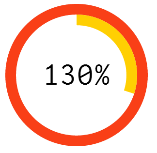

<h2>QSense Gauge</h2>

<h3>Introduction</h3>

  This gauge is based on BrightPoint Consulting D3.js graph

<h3>Installation</h3>
<h4>Desktop</h4>
<ul>
 <li>Download the project (or checkout)</li>
 <li>Unzip the file</li>
 <li>Copy the complete folder to C:\Users\userName\Documents\Qlik\Sense\Extensions</li>
</ul>
<h4>Server</h4>
<ul>
 <li>Download the project (or checkout)</li>
 <li>Go to QMC, Extensions and import the zip file</li>
</ul>
<h3>Case of use</h3>

You can add 2 measures, change limits, colors and add image.

<h4>Features</h4>
<ul>
  <li>2 measures</li>
  <li>Change limit of each arc</li>
  <li>Change color (Qlik Sense color picker)</li>
  <li>Add an image</li>
  <li>Enable/disable numbers</li>
  <li>Run on Qlik Sense 2.2</li>
</ul

<h4>Change log</h4>
<ul>
  <li>1.0.1 Use Qlik Sense format</li>
</ul>

